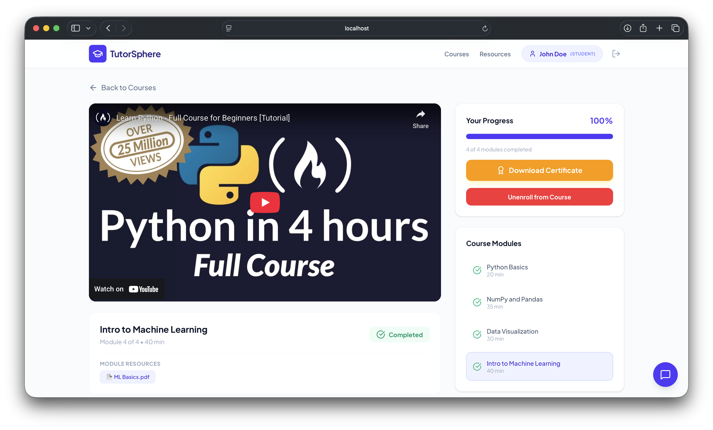

# TutorSphere - STEM & ICT Learning Platform

A comprehensive web-based platform connecting students with qualified STEM and ICT tutors, featuring automated validation, session booking, and AI-powered learning support.

## 🚀 Features

- **User Authentication**: Secure login system for students and tutors
- **Course Management**: Browse and enroll in STEM/ICT courses
- **Tutor Dashboard**: Manage courses and sessions for tutors
- **Resource Library**: Access learning materials and resources
- **AI-Powered Chatbot**: Get instant help and support
- **Certificate Generation**: Earn certificates upon course completion
- **Responsive Design**: Works seamlessly on desktop and mobile devices

## � Screenshots

### Login Page


### Dashboard


### Course Details


## �🛠️ Tech Stack

### Frontend
- **React 19** - Modern JavaScript library for building user interfaces
- **TypeScript** - Typed JavaScript for better development experience
- **Tailwind CSS** - Utility-first CSS framework
- **React Router** - Declarative routing for React
- **Lucide React** - Beautiful & consistent icon toolkit

### Backend
- **Node.js** - JavaScript runtime
- **Express.js** - Web application framework
- **Vite** - Fast build tool and development server

### Additional Libraries
- **jsPDF** - Generate PDF certificates
- **Dotenv** - Environment variable management

## 📋 Prerequisites

- Node.js (version 16 or higher)
- npm or yarn package manager

## 🔧 Installation

1. **Clone the repository**
   ```bash
   git clone <repository-url>
   cd tutorsphere2
   ```

2. **Install dependencies**
   ```bash
   npm install
   ```

3. **Environment Setup**
   - Copy `.env.example` to `.env.local`
   - Add your API keys and configuration

4. **Start the development server**
   ```bash
   npm run dev
   ```

5. **Open your browser**
   - Navigate to `http://localhost:3000`

## 📖 Usage

### For Students
- Register/Login to access the platform
- Browse available courses
- Enroll in courses of interest
- Access learning resources
- Complete modules and earn certificates
- Use the AI chatbot for assistance

### For Tutors
- Register as a tutor
- Create and manage courses
- Upload learning materials
- Track student progress
- Generate certificates

## 🏗️ Project Structure

```
tutorsphere2/
├── src/
│   ├── components/          # Reusable UI components
│   │   ├── CertificateModal.tsx
│   │   ├── Chatbot.tsx
│   │   ├── CourseCard.tsx
│   │   ├── Navbar.tsx
│   │   └── ResourceCard.tsx
│   ├── context/             # React context providers
│   │   └── AuthContext.tsx
│   ├── data/                # Static data files
│   │   ├── courses.json
│   │   ├── resources.json
│   │   └── users.json
│   ├── pages/               # Page components
│   │   ├── CourseDetailsPage.tsx
│   │   ├── CoursesPage.tsx
│   │   ├── LoginPage.tsx
│   │   ├── ResourcesPage.tsx
│   │   └── TutorCourseManager.tsx
│   ├── services/            # API and utility services
│   │   ├── authService.ts
│   │   ├── courseService.ts
│   │   ├── downloadService.ts
│   │   ├── fileStore.ts
│   │   ├── moduleResourceDownload.ts
│   │   └── resourceService.ts
│   ├── types.ts             # TypeScript type definitions
│   ├── App.tsx              # Main application component
│   ├── index.css            # Global styles
│   └── main.tsx             # Application entry point
├── server.ts                # Express server
├── package.json             # Project dependencies
├── tsconfig.json            # TypeScript configuration
├── vite.config.ts           # Vite configuration
└── README.md               # Project documentation
```

## 🧪 Available Scripts

- `npm run dev` - Start development server
- `npm run build` - Build for production
- `npm run preview` - Preview production build
- `npm run clean` - Clean build directory
- `npm run lint` - Run TypeScript type checking

## 🤝 Contributing

1. Fork the repository
2. Create a feature branch (`git checkout -b feature/amazing-feature`)
3. Commit your changes (`git commit -m 'Add some amazing feature'`)
4. Push to the branch (`git push origin feature/amazing-feature`)
5. Open a Pull Request

## 📄 License

This project is licensed under the MIT License - see the LICENSE file for details.

## 📞 Support

For support, please contact the development team or create an issue in the repository.
